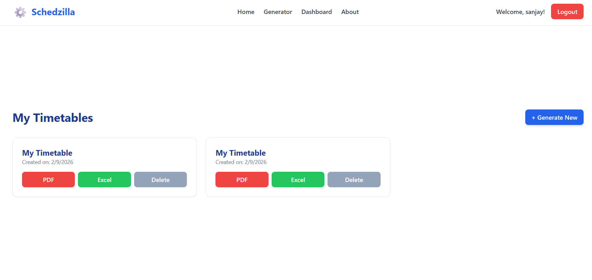
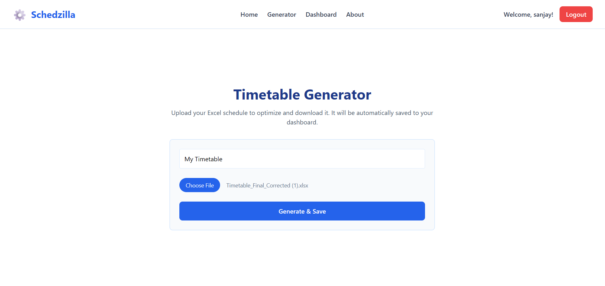

# 🎓 Intelligent Academic Scheduling Engine

An AI-driven system designed to automatically generate optimized academic timetables by efficiently allocating courses, faculty, classrooms, and time slots while avoiding conflicts.

---

## 📌 Project Overview

The **Intelligent Academic Scheduling Engine** addresses the complexity of academic timetable creation by using intelligent algorithms to:

- Reduce scheduling conflicts
- Optimize resource utilization
- Save time compared to manual scheduling
- Improve overall academic planning efficiency

This system is suitable for **schools, colleges, and universities**.

---
## 🖥️ Application Screenshots

### 📊 Dashboard – Manage Timetables
Displays saved timetables with options to download or delete.



---

### ⚙️ Timetable Generator
Upload your Excel file and generate an optimized schedule instantly.



---

### ✅ File Processed & Ready to Download
Download the generated timetable in PDF or Excel format.


---

## 🚀 Features

- 📅 Automatic timetable generation  
- 👨‍🏫 Faculty availability handling  
- 🏫 Classroom allocation optimization  
- ⚠️ Conflict detection & resolution  
- 🔄 Flexible schedule updates  
- 📊 Efficient resource utilization  

---

## 🧠 Technologies Used

- **Programming Language:** Python  
- **Framework:** Flask  
- **AI / Logic:** Constraint-based logic / Optimization algorithms  
- **Frontend:** HTML, CSS, JavaScript  
- **Backend:** Flask REST API  
- **Database (optional):** SQLite / MySQL  

---

## 🏗️ System Architecture

1. User inputs academic constraints  
2. Scheduling engine processes data  
3. Intelligent algorithm generates optimized schedule  
4. Timetable is displayed/exported  

---

## ⚙️ Installation & Setup

### 1️⃣ Clone the Repository
```bash
git clone https://github.com/Sanjay001kumar/Intelligent_Academic_Scheduling_Engine.git
cd Intelligent_Academic_Scheduling_Engine
